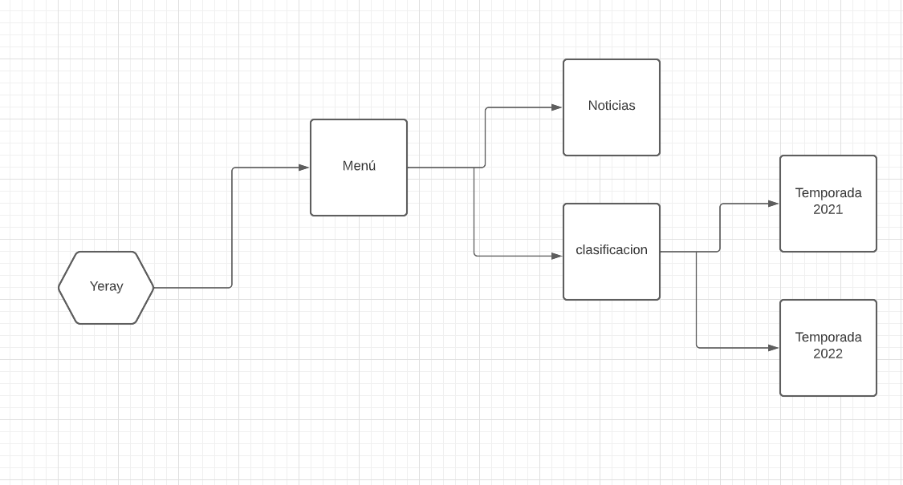

# Projecto f1

## hecho por yeray Ibáñez

### enlaces

[github](https://github.com/Yeray1993/ProjectoObjetos)

## [pages](http://www.yeray.ml)

## 

---

### Descripcion del proyecto

1. En este proyecto daremos un repaso a la temporada 2022 de la fórmula 1 ademas de recordar a algunos de los mas grandes pilotos y rivalidades de la historia. también veremos algunas noticias relacionadas con el cambio de reglamento para la temporada 2023.  

<h3>Para ello hemos utilizado css y html.</h3>
